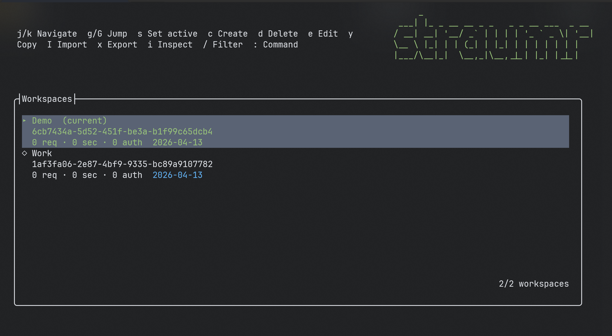
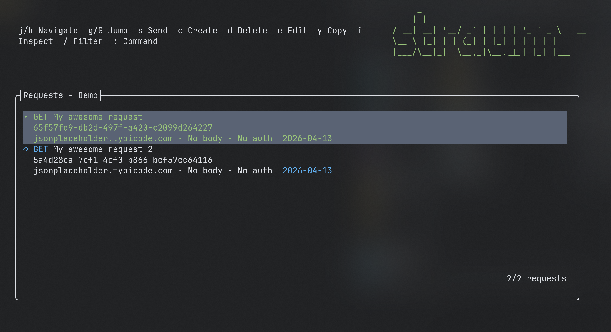
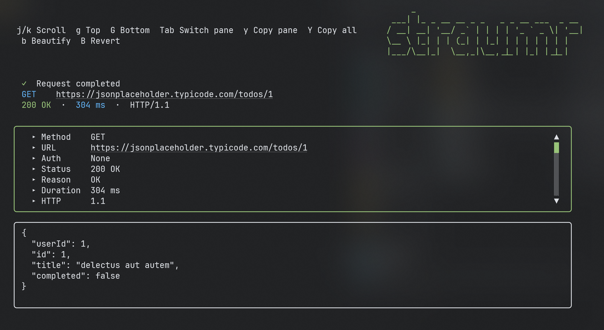

<div align="center">
  
</div>

<br>

<!-- ABOUT:START -->
Straumr is a CLI tool for managing and sending HTTP requests. You define requests once, save them to a workspace, and run them whenever you need. No GUI, no browser, just the terminal.

It handles authentication templates, secrets, and multiple workspaces, so you can keep work, staging, and personal projects separate without duplicating config.
<!-- ABOUT:END -->

## A look at the TUI

Running `straumr` with no arguments drops you into a full-screen terminal UI. Pick a workspace, browse its requests, and send them without leaving the keyboard. Navigation uses vim motions (`h`/`j`/`k`/`l`) alongside the usual arrow keys.

<table>
  <tr>
    <td align="center">
      
      <br />
      <sub><b>Workspaces</b> — pick which workspace to work in.</sub>
    </td>
    <td align="center">
      
      <br />
      <sub><b>Requests</b> — saved requests in the active workspace.</sub>
    </td>
  </tr>
  <tr>
    <td colspan="2" align="center">
      
      <br />
      <sub><b>Send</b> — the resolved request and the response it got back, side by side.</sub>
    </td>
  </tr>
</table>

## Documentation

Detailed documentation lives in [`docs/`](docs/README.md):

- [User Workflows](docs/user-workflows.md)
- [Command Reference](docs/command-reference.md)
- [Themes](docs/themes.md)
- [Data Model](docs/data-model.md)
- [Architecture](docs/architecture.md)
- [Development](docs/development.md)

## Features

**Workspaces**

Group your requests into workspaces. Each workspace is its own isolated collection with its own auth templates and metadata. You can export a workspace to share it with a teammate or import one from a file.

**Requests**

Create requests with any HTTP method, headers, query parameters, and a body. Body types supported: JSON, XML, form-encoded, multipart, plain text, and raw. When you send a request, Straumr can pretty-print JSON and XML responses, follow redirects, save output to a file, or run silently in a script.

**Authentication**

Straumr supports four auth types you can configure as reusable templates:

- **Bearer** - a static token injected as an Authorization header
- **Basic** - username and password, Base64 encoded
- **OAuth 2.0** - full token lifecycle with automatic refresh (supports authorization code, client credentials, and password grant types)
- **Custom** - define your own header-based auth

Attach an auth template to a request and it's applied automatically on send. OAuth tokens that expire get refreshed without you having to do anything.

**Secrets**

Store API keys, tokens, and other sensitive values as named secrets. Reference them in request URLs, headers, body, or auth templates using `{{secret:<name>}}`. Secrets are global across all workspaces.

**Interactive TUI**

Running `straumr` with no arguments drops you into a full-screen terminal UI backed by [Terminal.Gui](https://github.com/gui-cs/Terminal.Gui). Browse and edit workspaces, requests, auths, and secrets, and send requests without leaving the keyboard. The CLI and the TUI share the exact same underlying services, so anything you can do in one is reflected in the other.

**Shell completion**

Install tab completion for bash, zsh, or PowerShell with a single command.

## Installation

### Windows (winget)

```
winget install AlbinAlm.Straumr
```

### Arch Linux (AUR)

```sh
yay -S straumr-bin
```

### Fedora / RHEL (COPR)

```sh
sudo dnf copr enable albinalm/straumr
sudo dnf install straumr
```

### Debian / Ubuntu (APT)

```sh
curl -fsSL https://albinalm.github.io/Straumr/straumr.gpg.key | sudo gpg --dearmor -o /usr/share/keyrings/straumr.gpg
echo "deb [signed-by=/usr/share/keyrings/straumr.gpg] https://albinalm.github.io/Straumr stable main" | sudo tee /etc/apt/sources.list.d/straumr.list
sudo apt update && sudo apt install straumr
```

### Manual

Download the latest release for your platform from the [releases page](https://github.com/albinalm/Straumr/releases).

```sh
# Linux
tar -xzf straumr-<version>-linux-x64.tar.gz
sudo mv straumr /usr/local/bin/

# Windows
# Extract the zip and add straumr.exe to your PATH
```

Verify downloads using the provided `sha256sums.txt` and `.minisig` signature files included in each release.

## Quick start

Launch the interactive TUI:

```sh
straumr
```

Any CLI invocation starts by getting a workspace in place:

```sh
straumr create workspace myapi
straumr use workspace myapi
```

Create a request and send it:

```sh
straumr create request get-users https://api.example.com/users --method GET
straumr send get-users --pretty
```

Use `-e` on `create request` / `edit request` to open the raw request JSON in `$EDITOR` instead:

```sh
straumr create request get-users -e
```

## Commands

| Group | Commands |
|---|---|
| `workspace` | via `create`, `use`, `list`, `get`, `edit`, `export`, `import`, `delete`, `copy` |
| `request` | via `create`, `edit`, `list`, `get`, `delete`, `copy` |
| `auth` | via `create`, `edit`, `list`, `get`, `delete`, `copy` |
| `secret` | via `create`, `edit`, `list`, `get`, `delete`, `copy` |
| `config` | `workspace-path` |
| `autocomplete` | `install` |
| top-level | `send` |

Run `straumr <command> --help` for details on any command.

## License

Straumr is free software, released under the [GNU General Public License v3.0](LICENSE).
