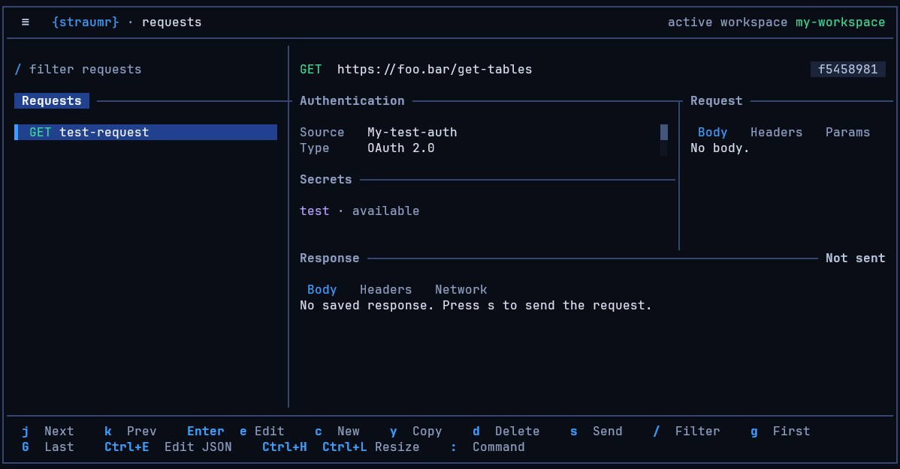
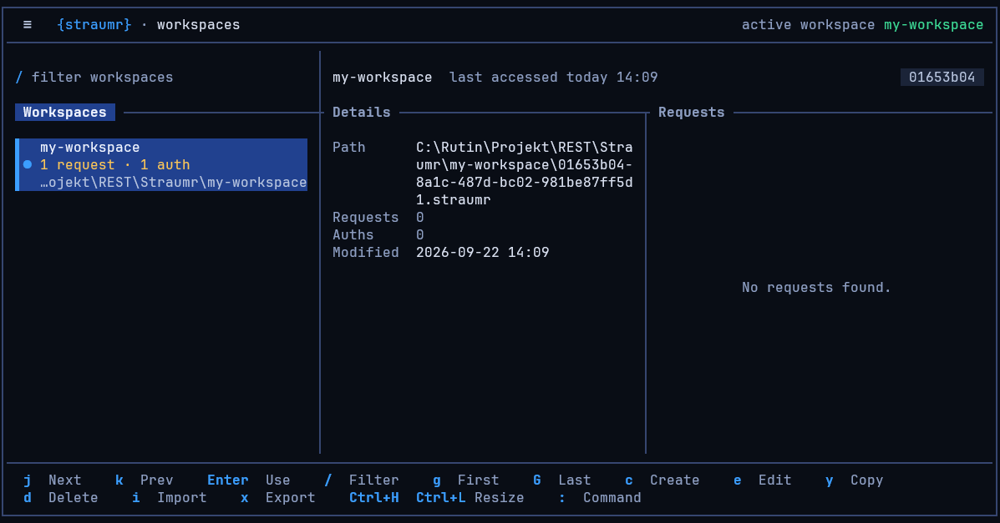

<div align="center">
  
  <p><em>A terminal HTTP client</em></p>
  <p>
    <a href="#features">Features</a> ·
    <a href="#installation">Installation</a> ·
    <a href="#quick-start">Quick start</a> ·
    <a href="#documentation">Documentation</a>
  </p>
  <table>
    <tr>
      <td align="center"></td>
      <td align="center"></td>
    </tr>
    <tr>
      <td align="center"><sub><b>Requests</b> — the resolved request and its response</sub></td>
      <td align="center"><sub><b>Workspaces</b> — every collection, with its details</sub></td>
    </tr>
  </table>
</div>

<!-- ABOUT:START -->
Straumr is a terminal HTTP client. Save requests in workspaces, reuse authentication, keep secrets out of request definitions, and send requests from a CLI or terminal UI.
<!-- ABOUT:END -->

## Features

### Workspaces

Group your requests into workspaces. Each workspace is its own isolated collection with its own auth templates and metadata. You can export a workspace to share it with a teammate or import one from a file.

### Requests

Create requests with any HTTP method, headers, query parameters, and a body. Body types supported: JSON, XML, form-encoded, multipart, plain text, and raw. When you send a request, Straumr can pretty-print JSON and XML responses, follow redirects, save output to a file, or run silently in a script.

### Authentication

Straumr supports four auth types you can configure as reusable templates:

| Type | What it does |
| --- | --- |
| **Bearer** | A static token injected as an `Authorization` header |
| **Basic** | Username and password, Base64 encoded |
| **OAuth 2.0** | Full token lifecycle with automatic refresh (authorization code, client credentials, and password grants) |
| **Custom** | Your own header-based auth |

Attach an auth template to a request and it's applied automatically on send. OAuth tokens that expire get refreshed without you having to do anything.

### Editable on disk

Workspaces, requests, auths, and secrets are stored as JSONC, so you can open one in your editor and annotate it: `//` and `/* */` comments and trailing commas are all accepted. Your comments stay put — Straumr carries them across its own rewrites rather than flattening the file the next time it touches it.

Editing is a handoff, not an imitation: bodies and resource files open in your `$EDITOR` and Straumr picks up the change when you close it.

### Secrets

Store API keys, tokens, and other sensitive values as named secrets. Reference them in request URLs, headers, body, or auth templates using `{{secret:<name>}}`. Secrets are global across all workspaces.

### Terminal UI

Run `straumr` without a command to open the terminal UI: a list of requests, the resolved request and its response side by side, and a `:` command prompt for everything else. Four keybinding presets — vim, emacs, commander, and client — and themes that either follow your terminal's palette or bring their own. CLI commands remain available for automation and shell workflows.

### Shell completion

Install tab completion for bash, zsh, or PowerShell with a single command.

## Installation

**Windows (winget)**

```
winget install AlbinAlm.Straumr
```

**Arch Linux (AUR)**

```sh
yay -S straumr-bin
```

**Fedora / RHEL (COPR)**

```sh
sudo dnf copr enable albinalm/straumr
sudo dnf install straumr
```

**Debian / Ubuntu (APT)**

```sh
curl -fsSL https://albinalm.github.io/Straumr/straumr.gpg.key | sudo gpg --dearmor -o /usr/share/keyrings/straumr.gpg
echo "deb [signed-by=/usr/share/keyrings/straumr.gpg] https://albinalm.github.io/Straumr stable main" | sudo tee /etc/apt/sources.list.d/straumr.list
sudo apt update && sudo apt install straumr
```

**Manual**

Download the latest release for your platform from the [releases page](https://github.com/albinalm/Straumr/releases).

```sh
# Linux
tar -xzf straumr-<version>-linux-x64.tar.gz
sudo mv straumr /usr/local/bin/

# Windows
# Extract the zip and add straumr.exe to your PATH
```

Verify downloads using the provided `sha256sums.txt` and `.minisig` signature files included in each release.

## Quick start

Run `straumr` and the terminal UI walks you through choosing a keybinding preset, a theme, and a first workspace.

From the shell instead — set a workspace location in `~/.straumr/settings.toml`:

```toml
[paths]
workspaces = "~/api-workspaces"
```

Then create and activate a workspace, create a request, and send it:

```sh
straumr create workspace myapi
straumr use workspace myapi
straumr create request get-users https://api.example.com/users --method GET
straumr send get-users --pretty
```

Without that setting, pass `-o <dir>` to `create workspace` to say where each one goes. Run `straumr <command> --help` for command-specific options.

## Documentation

- [Using Straumr](docs/using-straumr.md) — workspaces, requests, auth, secrets, scripting
- [The terminal UI](docs/terminal-ui.md) — screens, the `:` command prompt, sending
- [Command reference](docs/command-reference.md) — the CLI map
- [Settings](docs/customize.md) and [keybindings](docs/keybinds.md)
- [Developer notes](docs/developer/README.md) — the codebase

`straumr about` prints the paragraph at the top of this file; `straumr --agent-help` prints a short guide for automation.

## License

Straumr is free software, released under the [GNU General Public License v3.0](LICENSE).
